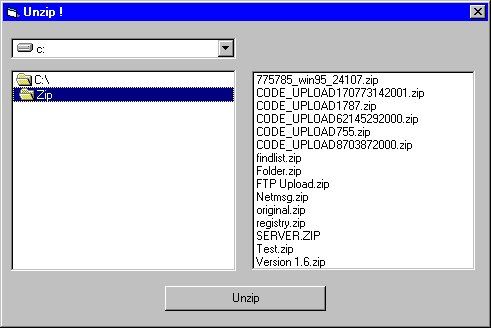



## ZIPDEMO \- Unzip all files in a directory

### Description

I always missed it in WinZip:

Unzip all files in a directory to the same directory.

Modify it, so the target directory can be at another place.
 
### More Info
 

             |
---                |---
**Submitted On**   |2001-03-26 09:46:24
**By**             |[Marcus Schmitt](https://github.com/Planet-Source-Code/PSCIndex/blob/master/ByAuthor/marcus-schmitt.md)
**Level**          |Advanced
**User Rating**    |3.8 (19 globes from 5 users)
**Compatibility**  |VB 5\.0, VB 6\.0
**Category**       |[Complete Applications](https://github.com/Planet-Source-Code/PSCIndex/blob/master/ByCategory/complete-applications__1-27.md)
**World**          |[Visual Basic](https://github.com/Planet-Source-Code/PSCIndex/blob/master/ByWorld/visual-basic.md)
**Archive File**   |[CODE\_UPLOAD176483282001\.zip](https://github.com/Planet-Source-Code/marcus-schmitt-zipdemo-unzip-all-files-in-a-directory__1-4311/archive/master.zip)

